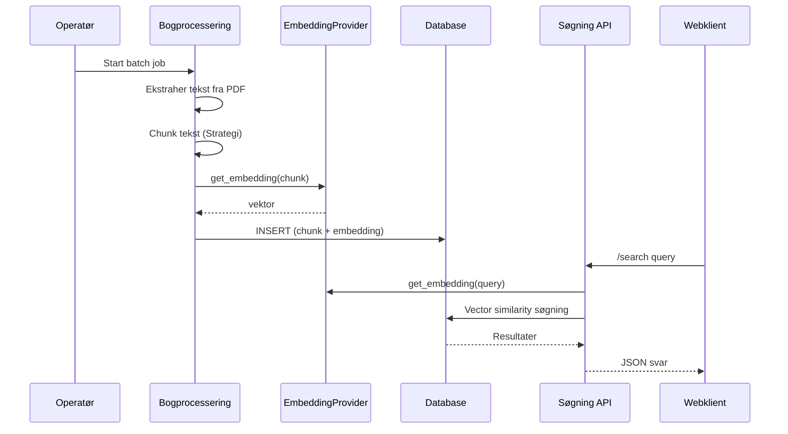

Titel: Systemarkitektur
Version: v1.0
Oprettet: 2025-09-04
Sidst ændret: 2025-09-04
Ejerskab: Arkitekturansvarlig
Formål: Kort, præcist overblik over systemets struktur og designprincipper

# 1. Formål
Dette dokument giver nye udviklere og vedligeholdere et kondenseret overblik.

# 2. Systemlandskab
```mermaid
flowchart LR
  A[PDF Kilder] --> B[Ekstraktion]
  B --> C[Chunking Strategi]
  C --> D[Embedding Provider]
  D --> E[(PostgreSQL + pgvector)]
  F[Search API (FastAPI)] --> E
  F --> G[Test GUI (Streamlit)]
  H[Klient / Website] --> F
```

# 3. Subsystemer
- Bogprocessering (batch) – læser, chunker, embedder og skriver til DB.
- Søgning (transaktionel) – modtager forespørgsel, beregner embedding, finder nærmeste naboer.
- Test GUI – lokal QA og manuelle forespørgsler.
- Database – PostgreSQL med pgvector udvidelse.

# 4. Delte Providers
| Type | Formål | Implementeringer |
|------|--------|------------------|
| Embedding | Tekst → vektor | openai, ollama, dummy |
| Chunking | Segmentering af tekst | sentence_splitter, word_overlap |
| Database | Persistens + similarity | PostgreSQL + pgvector |

# 5. Dataflow (sekvens)


# 6. Designprincipper
- Dependency Injection på alle providers.
- Udskiftelighed (fabrikker + strategimønstre).
- Defensiv validering (chunk_text som streng).
- Observérbarhed: struktureret logging + rotationsfiler.
- Fail fast i testmiljø – robust i produktion (fortsæt enkeltsvigt i batch).

# 7. Nøglekomponenter (uddrag)
| Komponent | Rolle |
|-----------|-------|
| book_processing_pipeline.py | Orkestrerer ekstraktion→chunking→embeddings |
| chunking.py | Strategifabrik og konkrete chunkers |
| providers/* | Implementeringer for embeddings |
| postgresql_service.py | DB operationer + similarity |
| dhosearch.py (el.lign.) | FastAPI lifecycle + DI |
| api_testgui/app.py | Streamlit testklient |

# 8. Eksterne afhængigheder
- PostgreSQL  + pgvector (vektorlagring og similarity)
- OpenAI API / Ollama (embedding generation)
- FastAPI (søgning), Streamlit (test GUI)
- pytest (test), coverage, Docker Compose (drift)

# 9. Fejl & Logging
- Roterende fil-logs (30 dages retention mål)
- Vigtige korrektioner logges (liste → streng konvertering)
- Adskil debug vs info i miljø via LOG_LEVEL.

# 10. Videre læsning
- Referencer: PROVIDER_OVERSIGT, CHUNKING_STRATEGIER, ENV_KONFIGURATION
- Udviklerguide for test og kvalitetsporte
