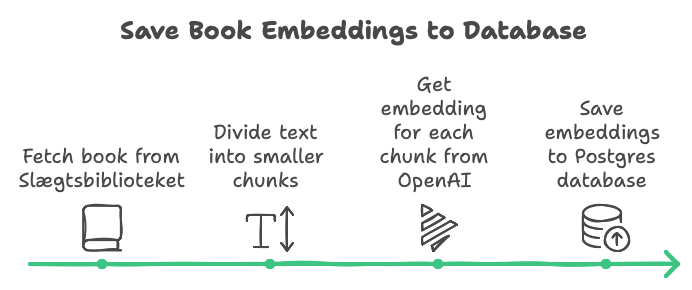
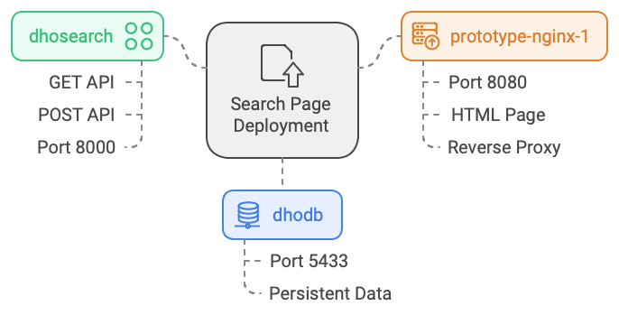

## General

Slægtsbibliotekets "Semantisk search" consists of two separate parts:
1. A Python batch script which processes the books which must have semantic search enabled
2. An very simple webpage where thr search may be performed from

## Batch processing of books

The Python scripts perform the following,

Input: A list of URL's where the books may be fetched from
Output: Embeddings for the books saved in a Postgres database

Steps:
1. For each book in input
2. Fetch book from Slægtsbiblioteket
3. Divide the text into smaller chunks of text
4. Call OpenAI to get an embedding for each chunk
5. Save embeddings to the Postgres database

## Search page
The search page allows the user to input a text and find the 5 best places in all of the books which contains information related to the input text. Optionally the user may input what chunk sizes were use for making the embeddings and which similarity function to use.

### Deploy of the search page

The search page is deployed on a Linux server in 3 Docker containers:
1. A container named "dhodb" containing the Postgres database. The container exposes the port 5433, which must be used to access the database. The data resides in a Docker volume so it is persistent between container reboots.
2. A container named "dhosearch" which an Python FastAPI app. It has two API's:
	1. A GET api in the root("/") which is just to give a Alive check
	2. A POST api ("/search/") taking the same parameters (query, chunk_size, distance_function) that the user may input on the web page. The container exposes port 8000 for access.
3. A container named "nginx-1" with a NGINX server. The server is the only accessible entry to the system. It serves the HTML page and functions also a reverse proxy to the API in the dhosearch container. It exposes the port 8080 for outside access to the web page.

All three containers are on an internal Docker network named "dho-network".

An .env file contains OpenAPI key, database parameters and allowed origins for calls to the search API.

